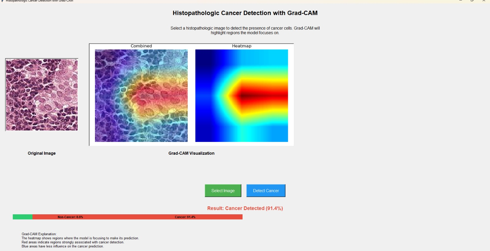

# 🧬 Histopathologic Cancer Detection - PatchCamelyon (PCam)

Détection automatique de tissus tumoraux à partir d'images microscopiques numériques à l'aide du dataset **PatchCamelyon (PCam)**.

## 📋 Description

Ce projet vise à construire une application pour ordinateur basée sur un modèle de classification binaire capable de prédire la présence de métastases dans de petites images (patches) extraites de lames histopathologiques numériques.

Le jeu de données PCam rend cette tâche accessible tout en étant cliniquement pertinente, idéale pour l'expérimentation en machine learning.

**Tâche** : 
- Prédire si la région centrale 32x32px d'une image 96x96px contient des cellules tumorales (1) ou non (0).

**Objectif de la compétition Kaggle** :
- Maximiser l'aire sous la courbe ROC (AUC-ROC).

## 🗂 Dataset

- **Source** : https://www.kaggle.com/c/histopathologic-cancer-detection/data
- **Licence** : CC0 (domaine public)
- **Images** : 220,025 patches (96x96 pixels, couleur)
- **Labels** : 
  - `1` : Tissu tumoral présent
  - `0` : Tissu tumoral absent

## 🏗 Structure du projet
    
    ├── ratt_ue_pro/
    │   └── sample_submission.csv
    │   ├── Notebook_project.ipynb
    │   ├── model_creation.ipynb # 1% of data 
    │   ├── best_model.pth
    │   ├── README.md
    │   ├── app.py # Application
    │   ├── train_labels.csv # images associés aux labels 
    │   ├── requirements-app.txt
    │   ├── requirements-notebook.txt

## 🧪 Modèles et techniques utilisés
- Entrainement ResNet avec les poids par DEFAULT pour le prototype.

- Data Augmentation pour augmenter la robustesse (rotations, flips horizontal, Resize, Normalization).

- Optimisation avec Adam.

- Métrique d'évaluation : Area Under the ROC Curve (AUC) / Accuracy (Correct/ Total).

## 📈 Résultats
Score de validation interne : ~0.99 AUC

Modèle léger : entraînable en quelques minutes sur un GPU/CPU (1% de la data)

Modèle lourd : entraînable en quelques heures sur un GPU unique.
